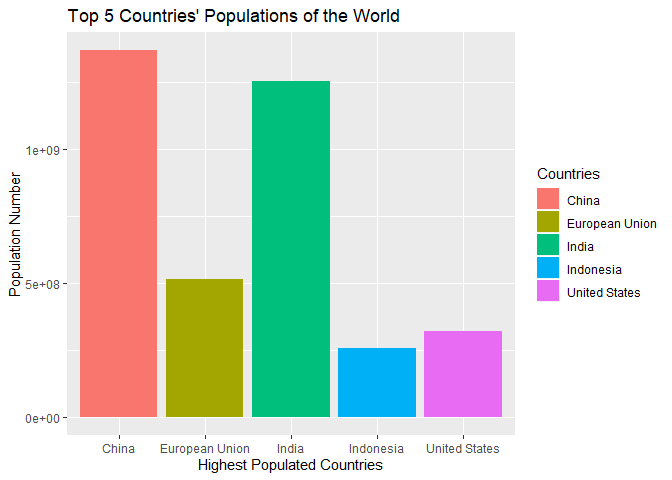
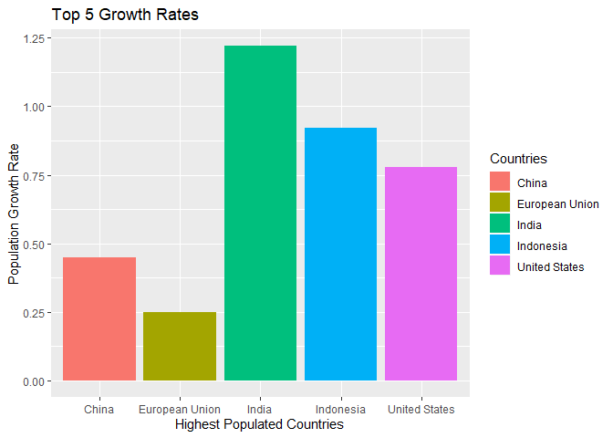
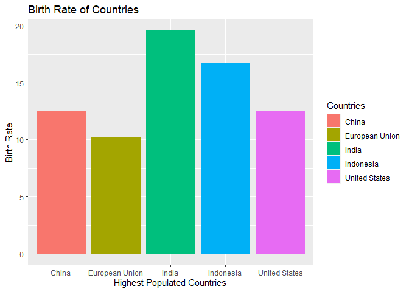
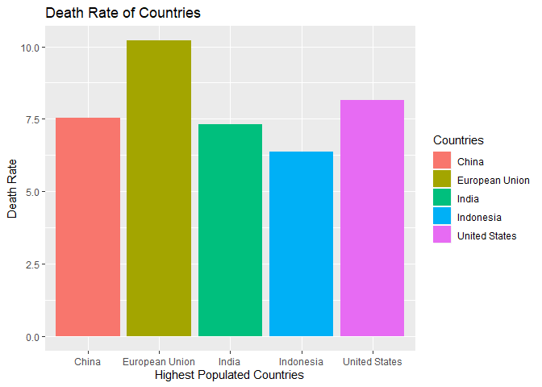
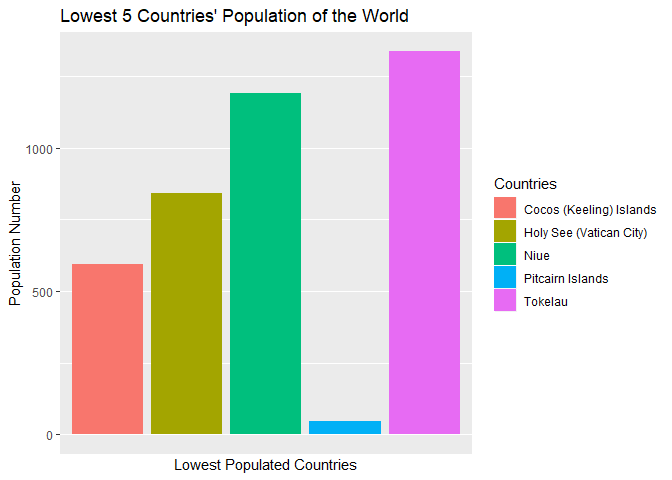
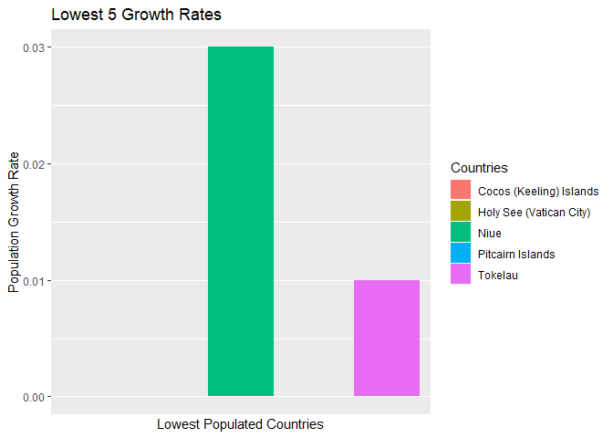
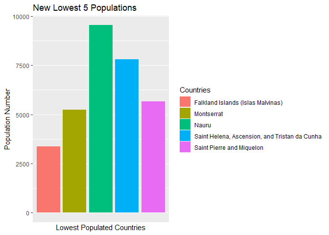
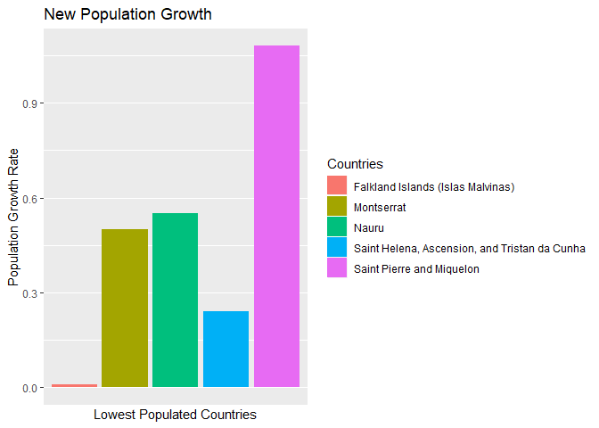
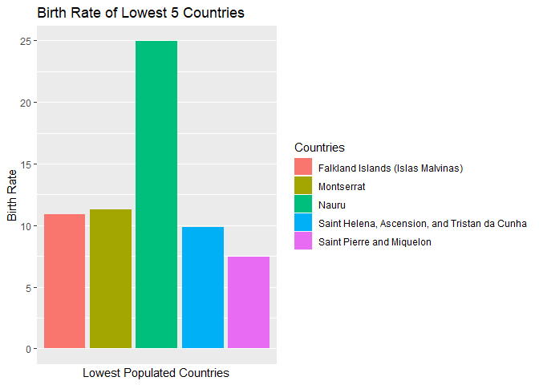
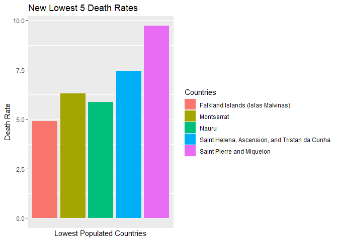

Goal: Analyzing the top 5 highest populations and the 5 lowest populations within the CIA Factbook Database
-----------------------------------------------------------------------------------------------------------

### Loading Packages

    library(RSQLite)
    library(DBI)
    library(dplyr)

    ## Warning: package 'dplyr' was built under R version 3.6.1

    ## 
    ## Attaching package: 'dplyr'

    ## The following objects are masked from 'package:stats':
    ## 
    ##     filter, lag

    ## The following objects are masked from 'package:base':
    ## 
    ##     intersect, setdiff, setequal, union

    library(ggplot2)

    ## Warning: package 'ggplot2' was built under R version 3.6.1

### Connecting to Factbook Database

    getwd()

    ## [1] "C:/Users/Toby/Desktop"

    setwd("C:/Users/Toby/Documents")

    connect <- dbConnect(SQLite(), "factbook.db" )
    dbListTables(connect)

    ## [1] "facts"           "sqlite_sequence"

### Examine First 5 Rows of Facts Table within Factbook

    SELECT * from facts LIMIT 5

<table>
<caption>5 records</caption>
<thead>
<tr class="header">
<th align="left">id</th>
<th align="left">code</th>
<th align="left">name</th>
<th align="right">area</th>
<th align="right">area_land</th>
<th align="right">area_water</th>
<th align="right">population</th>
<th align="right">population_growth</th>
<th align="right">birth_rate</th>
<th align="right">death_rate</th>
<th align="right">migration_rate</th>
<th align="left">created_at</th>
<th align="left">updated_at</th>
</tr>
</thead>
<tbody>
<tr class="odd">
<td align="left">1</td>
<td align="left">af</td>
<td align="left">Afghanistan</td>
<td align="right">652230</td>
<td align="right">652230</td>
<td align="right">0</td>
<td align="right">32564342</td>
<td align="right">2.32</td>
<td align="right">38.57</td>
<td align="right">13.89</td>
<td align="right">1.51</td>
<td align="left">2015-11-01 13:19:49.461734</td>
<td align="left">2015-11-01 13:19:49.461734</td>
</tr>
<tr class="even">
<td align="left">2</td>
<td align="left">al</td>
<td align="left">Albania</td>
<td align="right">28748</td>
<td align="right">27398</td>
<td align="right">1350</td>
<td align="right">3029278</td>
<td align="right">0.30</td>
<td align="right">12.92</td>
<td align="right">6.58</td>
<td align="right">3.30</td>
<td align="left">2015-11-01 13:19:54.431082</td>
<td align="left">2015-11-01 13:19:54.431082</td>
</tr>
<tr class="odd">
<td align="left">3</td>
<td align="left">ag</td>
<td align="left">Algeria</td>
<td align="right">2381741</td>
<td align="right">2381741</td>
<td align="right">0</td>
<td align="right">39542166</td>
<td align="right">1.84</td>
<td align="right">23.67</td>
<td align="right">4.31</td>
<td align="right">0.92</td>
<td align="left">2015-11-01 13:19:59.961286</td>
<td align="left">2015-11-01 13:19:59.961286</td>
</tr>
<tr class="even">
<td align="left">4</td>
<td align="left">an</td>
<td align="left">Andorra</td>
<td align="right">468</td>
<td align="right">468</td>
<td align="right">0</td>
<td align="right">85580</td>
<td align="right">0.12</td>
<td align="right">8.13</td>
<td align="right">6.96</td>
<td align="right">0.00</td>
<td align="left">2015-11-01 13:20:03.659945</td>
<td align="left">2015-11-01 13:20:03.659945</td>
</tr>
<tr class="odd">
<td align="left">5</td>
<td align="left">ao</td>
<td align="left">Angola</td>
<td align="right">1246700</td>
<td align="right">1246700</td>
<td align="right">0</td>
<td align="right">19625353</td>
<td align="right">2.78</td>
<td align="right">38.78</td>
<td align="right">11.49</td>
<td align="right">0.46</td>
<td align="left">2015-11-01 13:20:08.625072</td>
<td align="left">2015-11-01 13:20:08.625072</td>
</tr>
</tbody>
</table>

### Examine the Min Population within Facts Table

    SELECT Name, MIN(Population) from facts

<table>
<caption>1 records</caption>
<thead>
<tr class="header">
<th align="left">name</th>
<th align="right">MIN(Population)</th>
</tr>
</thead>
<tbody>
<tr class="odd">
<td align="left">Antarctica</td>
<td align="right">0</td>
</tr>
</tbody>
</table>

### Examine the Max Population within Facts Table

    SELECT Name, MAX(Population) from facts

<table>
<caption>1 records</caption>
<thead>
<tr class="header">
<th align="left">name</th>
<th align="right">MAX(Population)</th>
</tr>
</thead>
<tbody>
<tr class="odd">
<td align="left">World</td>
<td align="right">7256490011</td>
</tr>
</tbody>
</table>

The results show 'World' as a country and its is considered the max
population within the facts table. The population of 'World' is in the
negative. It would be best to remove this record within the table so
overall table is not affected by this outlier.

### Examine the Min Population Growth within Facts Table

    SELECT Name, MIN(population_growth) from facts

<table>
<caption>1 records</caption>
<thead>
<tr class="header">
<th align="left">name</th>
<th align="right">MIN(population_growth)</th>
</tr>
</thead>
<tbody>
<tr class="odd">
<td align="left">Holy See (Vatican City)</td>
<td align="right">0</td>
</tr>
</tbody>
</table>

### Examine the Max Population Growth within Facts Table

    SELECT Name, MAX(population_growth) from facts

<table>
<caption>1 records</caption>
<thead>
<tr class="header">
<th align="left">name</th>
<th align="right">MAX(population_growth)</th>
</tr>
</thead>
<tbody>
<tr class="odd">
<td align="left">South Sudan</td>
<td align="right">4.02</td>
</tr>
</tbody>
</table>

### Examine Population of Facts Table

    SELECT Name, population from facts

<table>
<caption>Displaying records 1 - 10</caption>
<thead>
<tr class="header">
<th align="left">name</th>
<th align="right">population</th>
</tr>
</thead>
<tbody>
<tr class="odd">
<td align="left">Afghanistan</td>
<td align="right">32564342</td>
</tr>
<tr class="even">
<td align="left">Albania</td>
<td align="right">3029278</td>
</tr>
<tr class="odd">
<td align="left">Algeria</td>
<td align="right">39542166</td>
</tr>
<tr class="even">
<td align="left">Andorra</td>
<td align="right">85580</td>
</tr>
<tr class="odd">
<td align="left">Angola</td>
<td align="right">19625353</td>
</tr>
<tr class="even">
<td align="left">Antigua and Barbuda</td>
<td align="right">92436</td>
</tr>
<tr class="odd">
<td align="left">Argentina</td>
<td align="right">43431886</td>
</tr>
<tr class="even">
<td align="left">Armenia</td>
<td align="right">3056382</td>
</tr>
<tr class="odd">
<td align="left">Australia</td>
<td align="right">22751014</td>
</tr>
<tr class="even">
<td align="left">Austria</td>
<td align="right">8665550</td>
</tr>
</tbody>
</table>

### Removal of 'World' as Population Max

    SELECT Name, MAX(Population) from facts WHERE Name IS NOT 'World'

<table>
<caption>1 records</caption>
<thead>
<tr class="header">
<th align="left">name</th>
<th align="right">MAX(Population)</th>
</tr>
</thead>
<tbody>
<tr class="odd">
<td align="left">China</td>
<td align="right">1367485388</td>
</tr>
</tbody>
</table>

China becomes the country with the most people. This is most accurate
than when the 'World' was considered the population max.

### Sorting Query to Show Top 5 Largest Populations

    SELECT name, population from facts WHERE Name IS NOT 'World' AND population != 0 ORDER BY population DESC LIMIT 5

    ggplot(aes(x= name, y= population), data = mydataframe) + geom_bar(aes(fill = name),stat = 'identity') + ggtitle("Top 5 Countries' Populations of the World") + xlab("Highest Populated Countries") + ylab("Population Number") + scale_fill_discrete(name = "Countries")

This bar graph shows that China and India has the most populations in
the world. The European Union, United States and Indonesia trail behind
the top two.

### Growth Rate of 5 of the Largest Populations

    SELECT name, population, population_growth from facts WHERE Name IS NOT 'World' AND population != 0 ORDER BY population DESC LIMIT 5

    ggplot(aes(x= name, y = population_growth), data = plot3) + geom_bar(aes(fill = name), stat = 'identity') + ggtitle("Top 5 Growth Rates") + xlab("Highest Populated Countries") + ylab("Population Growth Rate") + scale_fill_discrete(name = "Countries")

India, Indonesia and the United States have the highest growth rates
among the five largest populations.

### Birth Rate of the Top 5 Largest Populations

    SELECT name, birth_rate, population from facts WHERE Name IS NOT 'World' AND population != 0 ORDER BY population DESC LIMIT 5

    ggplot(aes(x= name, y = birth_rate), data = plot5) + geom_bar(aes(fill = name), stat = 'identity') + ggtitle("Birth Rate of Countries") + xlab("Highest Populated Countries") + ylab("Birth Rate") + scale_fill_discrete(name = "Countries")

Like the first two graphs, India has the highest birth rates. Indonesia,
United States and China also have high birth rates. The European Union
has the lowest birth rate among the five of them.

### Death Rate of the 5 Largest Populations

    SELECT name, death_rate, population from facts WHERE Name IS NOT 'World' AND population != 0 ORDER BY population DESC LIMIT 5

    ggplot(aes(x= name, y = death_rate), data = plot6) + geom_bar(aes(fill = name), stat = 'identity') + ggtitle("Death Rate of Countries") + xlab("Highest Populated Countries") + ylab("Death Rate") + scale_fill_discrete(name = "Countries")

The European Union has the highest death rate. United States, China and
India have death rates trailing behind the EU. Indonesia is has the
lowest death rates.

### Result of the Top 5 Largest Populations

~India's population will keep increasing due to high growth rate, high
birth rates and low death rates

~Indonesia's population will keep increasing due to high growth rates,
high birth rates and low death rates. Currently, it is the fifth largest
population in the world. In the future, may reach a higher ranking.

~The European Union's population will decrease due to low growth rates,
low birth rates and high death rates. Perhaps it would be better to
examine the individual countries within the EU instead of grouping them
as a whole.

### Sorting Query to Show 5 Smallest Populations

    SELECT name, population from facts WHERE Name IS NOT 'World' AND population != 0 ORDER BY population LIMIT 5

    ggplot(aes(x= name, y= population), data = plot2) + geom_bar(aes(fill = name), stat = 'identity') + ggtitle("Lowest 5 Countries' Population of the World") + xlab("Lowest Populated Countries") + ylab("Population Number") + theme(axis.text.x = element_blank()) + scale_x_discrete(breaks=NULL) + scale_fill_discrete(name = "Countries")

THe Pitcairn Islands and the Cocos (Keeling) Islands have the smallest
populations in the world.

### Growth Rate of 5 of the Smallest Populations

    SELECT name, population, population_growth from facts WHERE Name IS NOT 'World' AND population != 0 ORDER BY population LIMIT 5

    ggplot(aes(x= name, y= population_growth), data = plot4) + geom_bar(aes(fill = name), stat = 'identity') + ggtitle("Lowest 5 Growth Rates") + xlab("Lowest Populated Countries") + ylab("Population Growth Rate") + theme(axis.text.x = element_blank()) + scale_x_discrete(breaks=NULL) + scale_fill_discrete(name = "Countries")

Only Niue and Tokelau have data about it growth rates. Holy See (Vatican
City), Cocos (Keeling) Islands and Pitcairn Islands do not have data on
growth rates.

### Birthrate of the Lowest 5 Populations

    SELECT name, birth_rate, population from facts WHERE NAME IS NOT 'World' AND population != 0 ORDER BY population LIMIT 5

<table>
<caption>5 records</caption>
<thead>
<tr class="header">
<th align="left">name</th>
<th align="right">birth_rate</th>
<th align="right">population</th>
</tr>
</thead>
<tbody>
<tr class="odd">
<td align="left">Pitcairn Islands</td>
<td align="right">NA</td>
<td align="right">48</td>
</tr>
<tr class="even">
<td align="left">Cocos (Keeling) Islands</td>
<td align="right">NA</td>
<td align="right">596</td>
</tr>
<tr class="odd">
<td align="left">Holy See (Vatican City)</td>
<td align="right">NA</td>
<td align="right">842</td>
</tr>
<tr class="even">
<td align="left">Niue</td>
<td align="right">NA</td>
<td align="right">1190</td>
</tr>
<tr class="odd">
<td align="left">Tokelau</td>
<td align="right">NA</td>
<td align="right">1337</td>
</tr>
</tbody>
</table>

None of the five smallest populations have data on birth rates.

### Death Rate of Lowest 5 Populations

    SELECT name, death_rate, population from facts WHERE Name IS NOT 'World' AND population != 0 ORDER BY population LIMIT 5

<table>
<caption>5 records</caption>
<thead>
<tr class="header">
<th align="left">name</th>
<th align="right">death_rate</th>
<th align="right">population</th>
</tr>
</thead>
<tbody>
<tr class="odd">
<td align="left">Pitcairn Islands</td>
<td align="right">NA</td>
<td align="right">48</td>
</tr>
<tr class="even">
<td align="left">Cocos (Keeling) Islands</td>
<td align="right">NA</td>
<td align="right">596</td>
</tr>
<tr class="odd">
<td align="left">Holy See (Vatican City)</td>
<td align="right">NA</td>
<td align="right">842</td>
</tr>
<tr class="even">
<td align="left">Niue</td>
<td align="right">NA</td>
<td align="right">1190</td>
</tr>
<tr class="odd">
<td align="left">Tokelau</td>
<td align="right">NA</td>
<td align="right">1337</td>
</tr>
</tbody>
</table>

Similarly, none of the populations have data on death rates.

### Query Newest Lowest 5 Populations with Data on Growth Rates, Birth Rates and Death Rates

    SELECT name, population, birth_rate, death_rate, population_growth from facts WHERE Name IS NOT 'World' AND population != 0 AND birth_rate != 'NA' AND death_Rate != 'NA' AND population_growth != 'NA'ORDER BY population LIMIT 5

<table>
<caption>5 records</caption>
<thead>
<tr class="header">
<th align="left">name</th>
<th align="right">population</th>
<th align="right">birth_rate</th>
<th align="right">death_rate</th>
<th align="right">population_growth</th>
</tr>
</thead>
<tbody>
<tr class="odd">
<td align="left">Falkland Islands (Islas Malvinas)</td>
<td align="right">3361</td>
<td align="right">10.90</td>
<td align="right">4.90</td>
<td align="right">0.01</td>
</tr>
<tr class="even">
<td align="left">Montserrat</td>
<td align="right">5241</td>
<td align="right">11.26</td>
<td align="right">6.30</td>
<td align="right">0.50</td>
</tr>
<tr class="odd">
<td align="left">Saint Pierre and Miquelon</td>
<td align="right">5657</td>
<td align="right">7.42</td>
<td align="right">9.72</td>
<td align="right">1.08</td>
</tr>
<tr class="even">
<td align="left">Saint Helena, Ascension, and Tristan da Cunha</td>
<td align="right">7795</td>
<td align="right">9.88</td>
<td align="right">7.44</td>
<td align="right">0.24</td>
</tr>
<tr class="odd">
<td align="left">Nauru</td>
<td align="right">9540</td>
<td align="right">24.95</td>
<td align="right">5.87</td>
<td align="right">0.55</td>
</tr>
</tbody>
</table>

    SELECT name, population, birth_rate, death_rate, population_growth from facts WHERE Name IS NOT 'World' AND population != 0 AND birth_rate != 'NA' AND death_Rate != 'NA' AND population_growth != 'NA'ORDER BY population LIMIT 5

Since the previous five populations had missing data or no data on
growth rate, birth rate or death rate, a new subset of five low
populations were queried. These five populations do not have any missing
data. These five populations will be considered as the lowest five
populations.

### Population of 5 of the Smallest Populations

    ggplot(aes(x = name, y = population), data = plot7) +geom_bar(aes(fill = name), stat = 'identity') +ggtitle("New Lowest 5 Populations") + xlab("Lowest Populated Countries") + ylab("Population Number") +
    theme(axis.text.x = element_blank()) + scale_x_discrete(breaks = NULL) + scale_fill_discrete(name = "Countries")

Among the new subset, Nauru and Saint Helena, Ascension, and Tristan de
Cunha has the highest population. Falkland Islands (Islas Malvinas) has
the smallest population.

### Population Growth of the 5 Smallest Populations

    ggplot(aes(x = name, y = population_growth), data = plot7) +geom_bar(aes(fill = name),stat = 'identity') +ggtitle("New Population Growth") + xlab("Lowest Populated Countries") + ylab("Population Growth Rate") +
    theme(axis.text.x = element_blank()) + scale_x_discrete(breaks = NULL) + scale_fill_discrete(name = "Countries")   

Represented in graph above, Falkland Islands (Islas Malvina) has the
lowest growth rate of 0.01. Saint Helena, Ascension, and Tristan da
Cunda is the second lowest population growth rate. Saint Pierre and
Miquelon, Nauru are the highest two population growths.

### Birth Rate of the 5 Smallest Populations

    ggplot(aes(x = name, y = birth_rate), data = plot7) +geom_bar(aes(fill = name),stat = 'identity') + ggtitle("Birth Rate of Lowest 5 Countries") + xlab("Lowest Populated Countries") + ylab("Birth Rate") + theme(axis.text.x = element_blank()) + scale_x_discrete(breaks=NULL) + scale_fill_discrete(name = "Countries")

Interestingly, Saint Pierre and Miquelon has the lowest birth rate.
Saint Helena, Ascension, and Tristan da Cunha has the second lowest
birth rate. The Falkland Islands (Islas Malvina) does not have the
lowest birth rate. Naura has the highest birth rate.

### Death Rate of the 5 Smallest Populations

    ggplot(aes(x = name, y = death_rate), data = plot7) +geom_bar(aes(fill = name),stat = 'identity') +ggtitle("New Lowest 5 Death Rates") + xlab("Lowest Populated Countries") + ylab("Death Rate") + theme(axis.text.x = element_blank()) + scale_x_discrete(breaks=NULL) + scale_fill_discrete(name = "Countries")

In the graph above, Saint Pierre and Miquelon and Saint Helena,
Ascension, and Tristan da Cunhahas the two highest death rates. Falkland
Islands (Islas Malvinas) has the lowest death rate. Naura has the death
rate second to last.

### Result of the 5 Smallest Populations

~Naura has the highest population among the five populations. It has the
second highest population growth, highest birth rate and second lowest
death rate. Naura will most likely keep growing as a population.

~Saint Helena, Ascension, and Tristan da Cunha has the second highest
population among the five. But its population growth is the second
lowest, the birth rate is also second lowest and has the second highest
death rate. It is most likely that Saint Helena, Ascension, and Tristan
de Cunha will decrease in population as years past if these rates are
constant.

~Saint Pierre and Miquelon has interesting rates. It has the lowest
birth rates and the highest death rates. But it has the highest
population growths. Its current population is in the middle. Even when
examining the numbers, its death rate (9.72) is higher than its birth
rate (7.42) and its population growth is (1.08). Other factors must be
involved with these observations.

~Similarly, Falkland Islands (Islas Malvinas) is an interesting
statistic. Its birth rate is in the middle (10.90) and death rate is the
lowest (4.90). Yet its population growth is (0.01). There must be other
factors to explain these observations.

### Reference

<https://www.cia.gov/library/publications/the-world-factbook/>

     
